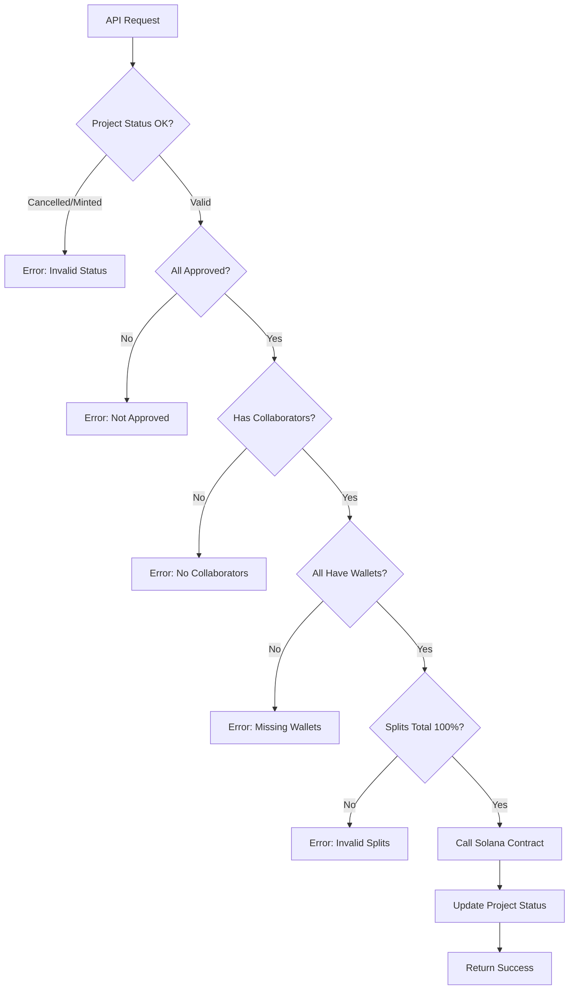

# Backend Django Integration for Collaborative NFT Minting

## Overview

The Django backend now integrates with the Solana blockchain smart contract to support collaborative NFT minting with automatic revenue splitting among multiple creators.

## Architecture

```
Frontend (React)
    ↓ API Request
Django Backend (REST API)
    ↓ Validation & Processing
Solana Integration Layer
    ↓ Transaction Building
Solana Blockchain (Smart Contract)
    → Automatic Revenue Distribution
```

## New Files

### 1. `backend/rb_core/utils/solana_integration.py`

Main integration module with the following functions:

#### `mint_collaborative_nft(project_id, sale_amount_usd, creator_splits, metadata_uri, title)`

Mints a collaborative NFT with automatic revenue splitting.

**Parameters:**
- `project_id` (int): Collaborative project ID
- `sale_amount_usd` (Decimal): Sale price in USD
- `creator_splits` (List[Dict]): Creator split data
  ```python
  [
      {
          'user_id': 1,
          'wallet_address': 'SolanaPublicKey...',
          'percentage': 70  # Must total 100%
      },
      ...
  ]
  ```
- `metadata_uri` (str): URI to NFT metadata (Arweave/IPFS)
- `title` (str): NFT title

**Returns:**
```python
{
    'success': True,
    'transaction_signature': 'abc123...',
    'mint_address': 'MintPublicKey...',
    'sale_amount_lamports': 1000000000,
    'platform_fee_lamports': 100000000,  # 10%
    'creator_splits': [...],
    'num_creators': 3
}
```

#### `validate_creator_splits(creator_splits)`

Validates creator split data:
- At least 1 creator, maximum 10 creators
- All collaborators have wallet addresses
- Percentages between 1-99%
- Total percentages = 100%

**Raises:**
- `InvalidCreatorSplitsError`: If splits are invalid
- `MissingWalletAddressError`: If wallet addresses missing

#### `convert_usd_to_lamports(usd_amount)`

Converts USD to Solana lamports.

**Parameters:**
- `usd_amount` (Decimal): Amount in USD

**Returns:**
- `int`: Amount in lamports (1 SOL = 1,000,000,000 lamports)

**Note:** Currently uses fixed SOL/USD rate from settings. In production, integrate with price oracle (Pyth, Chainlink).

#### `get_platform_fee_account()`

Returns platform's fee collection wallet address from settings.

**Returns:**
- `str`: Platform wallet public key

### 2. `backend/rb_core/utils/__init__.py`

Package initialization exposing public API:
```python
from .solana_integration import (
    mint_collaborative_nft,
    mint_single_creator_nft,
    get_platform_fee_account,
    validate_creator_splits,
)
```

## API Endpoint

### POST `/api/collaborative-projects/{id}/mint_collaborative_nft/`

Mints a collaborative NFT for an approved project.

#### Authentication

Requires authentication. User must be a collaborator on the project.

#### Request

```http
POST /api/collaborative-projects/5/mint_collaborative_nft/
Content-Type: application/json
Authorization: Session <session_id>
```

No request body required - all data is fetched from the project.

#### Response (Success)

```json
{
  "success": true,
  "message": "Collaborative NFT minted successfully",
  "transaction_signature": "5S74W2PaN6k9e7mg3D6W6DJgijULUPzdndVgF4GdFAkG...",
  "mint_address": "9ZACvfz6GNqa7fvtXTbsWUKjgzHUeJwxg4qiG8oRB7eH",
  "sale_amount_lamports": 1000000000,
  "platform_fee_lamports": 100000000,
  "creator_splits": [
    {
      "creator_pubkey": "Creator1PublicKey...",
      "percentage": 70
    },
    {
      "creator_pubkey": "Creator2PublicKey...",
      "percentage": 30
    }
  ],
  "num_creators": 2,
  "project_id": 5,
  "project_title": "Collaborative Book Project"
}
```

#### Response (Error)

```json
{
  "error": "All collaborators must approve before minting",
  "detail": "Check that all collaborators have approved the current version and revenue split"
}
```

#### Error Cases

| Error | HTTP Status | Description |
|-------|------------|-------------|
| Project already minted | 400 | Cannot mint twice |
| Project cancelled | 400 | Cannot mint cancelled projects |
| Not all approved | 400 | All collaborators must approve |
| No collaborators | 400 | Need at least one collaborator |
| Missing wallet addresses | 400 | All collaborators need wallet addresses |
| Splits don't total 100% | 400 | Revenue splits must total 100% |

## Validation Flow



## Configuration

### Django Settings (`backend/renaissBlock/settings.py`)

```python
# Collaborative NFT Minting Configuration
SOLANA_PLATFORM_WALLET = os.getenv(
    'SOLANA_PLATFORM_WALLET',
    'DawrJxixCJ2zbTCn83YRB5kZJC6zM6N36FYqGZUzNHDA'
)

# SOL/USD price for converting USD amounts to lamports
# In production, use price oracle
SOL_PRICE_USD = os.getenv('SOL_PRICE_USD', '100.00')

# Enable collaborative minting feature
FEATURE_COLLABORATIVE_MINTING = os.getenv(
    'FEATURE_COLLABORATIVE_MINTING',
    'true'
).lower() in ('1', 'true', 'yes', 'on')
```

### Environment Variables

Set these in `.env` or deployment environment:

```bash
# Platform wallet for fee collection (REQUIRED for production)
SOLANA_PLATFORM_WALLET=YourPlatformWalletPublicKey

# SOL/USD conversion rate (optional, default: 100.00)
SOL_PRICE_USD=150.00

# Enable/disable collaborative minting (optional, default: true)
FEATURE_COLLABORATIVE_MINTING=true

# Solana RPC URL (optional, default: devnet)
SOLANA_RPC_URL=https://api.mainnet-beta.solana.com
```

## Usage Examples

### Example 1: Mint Collaborative Book

```python
from backend.rb_core.utils.solana_integration import mint_collaborative_nft
from decimal import Decimal

# 2 authors collaborating on a book
creator_splits = [
    {
        'user_id': 1,
        'wallet_address': 'Author1SolanaWallet...',
        'percentage': 60  # Main author gets 60%
    },
    {
        'user_id': 2,
        'wallet_address': 'Author2SolanaWallet...',
        'percentage': 40  # Co-author gets 40%
    }
]

result = mint_collaborative_nft(
    project_id=5,
    sale_amount_usd=Decimal('15.00'),
    creator_splits=creator_splits,
    metadata_uri='https://arweave.net/book_metadata_123',
    title='Collaborative Fantasy Novel'
)

if result['success']:
    print(f"Minted! Transaction: {result['transaction_signature']}")
    print(f"Platform fee: {result['platform_fee_lamports']} lamports")
else:
    print(f"Error: {result['error']}")
```

### Example 2: Frontend Integration (React)

```typescript
// frontend/src/api/collaborationApi.ts

export const mintCollaborativeNFT = async (projectId: number) => {
  const response = await fetch(
    `/api/collaborative-projects/${projectId}/mint_collaborative_nft/`,
    {
      method: 'POST',
      credentials: 'include',
      headers: {
        'Content-Type': 'application/json',
      },
    }
  );

  if (!response.ok) {
    const error = await response.json();
    throw new Error(error.error || 'Failed to mint NFT');
  }

  return await response.json();
};

// Usage in component
const handleMint = async () => {
  try {
    const result = await mintCollaborativeNFT(project.id);
    console.log('NFT minted!', result);
    alert(`Success! Transaction: ${result.transaction_signature}`);
  } catch (error) {
    console.error('Minting failed:', error);
    alert(`Error: ${error.message}`);
  }
};
```

## Smart Contract Integration

### Revenue Distribution Flow

For a 1 SOL sale with 2 creators (70/30 split):

```
Sale Amount: 1.0 SOL (1,000,000,000 lamports)
    ├─ Platform Fee (10%): 0.1 SOL (100,000,000 lamports) → Platform Wallet
    └─ Remaining (90%): 0.9 SOL (900,000,000 lamports)
        ├─ Creator 1 (70%): 0.63 SOL (630,000,000 lamports) → Creator 1 Wallet
        └─ Creator 2 (30%): 0.27 SOL (270,000,000 lamports) → Creator 2 Wallet
```

### Transaction Details

1. **Buyer pays**: 1.0 SOL from buyer wallet
2. **Platform receives**: 0.1 SOL (10% platform fee)
3. **Creator 1 receives**: 0.63 SOL (70% of remaining 0.9 SOL)
4. **Creator 2 receives**: 0.27 SOL (30% of remaining 0.9 SOL)
5. **NFT minted**: 1 token transferred to buyer's wallet

All transfers happen atomically in a single Solana transaction.

## Testing

### Unit Tests

```python
# backend/rb_core/tests.py

from decimal import Decimal
from django.test import TestCase
from .utils.solana_integration import (
    validate_creator_splits,
    convert_usd_to_lamports,
    InvalidCreatorSplitsError,
    MissingWalletAddressError,
)

class SolanaIntegrationTests(TestCase):
    def test_validate_creator_splits_valid(self):
        """Valid splits should pass validation."""
        splits = [
            {'user_id': 1, 'wallet_address': 'abc', 'percentage': 70},
            {'user_id': 2, 'wallet_address': 'def', 'percentage': 30},
        ]
        validate_creator_splits(splits)  # Should not raise

    def test_validate_creator_splits_invalid_total(self):
        """Splits not totaling 100% should raise error."""
        splits = [
            {'user_id': 1, 'wallet_address': 'abc', 'percentage': 60},
            {'user_id': 2, 'wallet_address': 'def', 'percentage': 30},
        ]
        with self.assertRaises(InvalidCreatorSplitsError):
            validate_creator_splits(splits)

    def test_validate_creator_splits_missing_wallet(self):
        """Missing wallet address should raise error."""
        splits = [
            {'user_id': 1, 'wallet_address': '', 'percentage': 100},
        ]
        with self.assertRaises(MissingWalletAddressError):
            validate_creator_splits(splits)

    def test_convert_usd_to_lamports(self):
        """USD should convert correctly to lamports."""
        # Assuming 1 SOL = $100
        lamports = convert_usd_to_lamports(Decimal('10.00'))
        self.assertEqual(lamports, 100_000_000)  # 0.1 SOL
```

### Integration Tests

```bash
# Test the API endpoint
curl -X POST http://localhost:8000/api/collaborative-projects/5/mint_collaborative_nft/ \
  -H "Content-Type: application/json" \
  -H "Cookie: sessionid=YOUR_SESSION_ID"
```

## Production Deployment

### 1. Set Environment Variables

```bash
# .env for production
SOLANA_PLATFORM_WALLET=YourMainnetPlatformWallet
SOLANA_RPC_URL=https://api.mainnet-beta.solana.com
SOL_PRICE_USD=150.00  # Or integrate price oracle
FEATURE_COLLABORATIVE_MINTING=true
```

### 2. Integrate Price Oracle

Replace fixed `SOL_PRICE_USD` with real-time oracle:

```python
# backend/rb_core/utils/price_oracle.py

import requests

def get_sol_usd_price():
    """Fetch current SOL/USD price from Pyth or CoinGecko."""
    response = requests.get(
        'https://api.coingecko.com/api/v3/simple/price',
        params={'ids': 'solana', 'vs_currencies': 'usd'}
    )
    return Decimal(str(response.json()['solana']['usd']))
```

### 3. Add Actual Solana Transaction Execution

Replace mock implementation with actual Solana calls:

```python
# backend/rb_core/utils/solana_integration.py

from solana.rpc.api import Client
from solana.transaction import Transaction
from anchorpy import Provider, Wallet, Program

def mint_collaborative_nft(...):
    # ... validation code ...

    # Initialize Solana client
    client = Client(settings.SOLANA_RPC_URL)

    # Load program
    program = Program(
        idl=load_idl(),
        program_id=settings.ANCHOR_PROGRAM_ID,
        provider=provider
    )

    # Execute mint instruction
    tx = await program.methods.mint_collaborative_nft(
        sale_amount_lamports=lamports,
        creator_splits=contract_splits,
        metadata_uri=metadata_uri,
        title=title
    ).accounts({
        'buyer': buyer_wallet,
        'platform': settings.SOLANA_PLATFORM_WALLET,
        'mint': mint_keypair.public_key,
        'buyerTokenAccount': buyer_token_account,
    }).remaining_accounts([
        {'pubkey': creator['wallet_address'], 'isWritable': True, 'isSigner': False}
        for creator in creator_splits
    ]).rpc()

    return {
        'success': True,
        'transaction_signature': str(tx),
        ...
    }
```

## Next Steps

1. **Frontend Integration**
   - Add "Mint NFT" button to collaborative project page
   - Show loading state during minting
   - Display transaction signature and mint address
   - Update UI when project status changes to 'minted'

2. **Metadata Upload**
   - Implement Arweave/IPFS upload for NFT metadata
   - Include project details, creator info, preview images

3. **Price Oracle Integration**
   - Replace fixed SOL/USD rate with Pyth or Chainlink oracle
   - Cache price with TTL to avoid rate limits

4. **Transaction Status Monitoring**
   - Poll transaction confirmation status
   - Display confirmation count to user
   - Handle transaction failures gracefully

5. **Marketplace Integration**
   - Create Content records for minted NFTs
   - Enable buying/selling of collaborative NFTs
   - Track secondary sales and royalties

## Security Considerations

1. **Wallet Validation**
   - Verify wallet addresses are valid Solana public keys
   - Ensure no duplicate wallet addresses in splits

2. **Authorization**
   - Only collaborators can mint
   - All collaborators must approve before minting
   - Prevent double-minting of same project

3. **Rate Limiting**
   - Implement rate limiting on mint endpoint
   - Prevent spam/DoS attacks

4. **Audit Trail**
   - Log all minting attempts
   - Store transaction signatures in database
   - Track failed minting attempts

5. **Private Key Security**
   - NEVER store private keys in code or database
   - Use secure key management (AWS KMS, HashiCorp Vault)
   - Platform wallet should use multi-sig in production

## Troubleshooting

### "All collaborators must have wallet addresses set"

**Solution:** Ensure all collaborators have connected their Solana wallets in their profile settings.

### "Revenue splits must total 100%"

**Solution:** Check the revenue percentages in the collaborative project. They must total exactly 100%.

### "Project has already been minted"

**Solution:** Each project can only be minted once. Create a new project for a new NFT.

### Transaction fails on blockchain

**Solution:**
- Check Solana RPC URL is accessible
- Verify platform wallet has enough SOL for transaction fees
- Check Solana network status
- Review transaction logs for specific errors

## Support

For questions or issues:
- Review smart contract tests: `blockchain/rb_contracts/tests/mint_collaborative.ts`
- Check Django logs: `backend/logs/django.log`
- Review Solana transaction on explorer: `https://explorer.solana.com/tx/{signature}`

## License

This integration is part of the renaissBlock platform.
